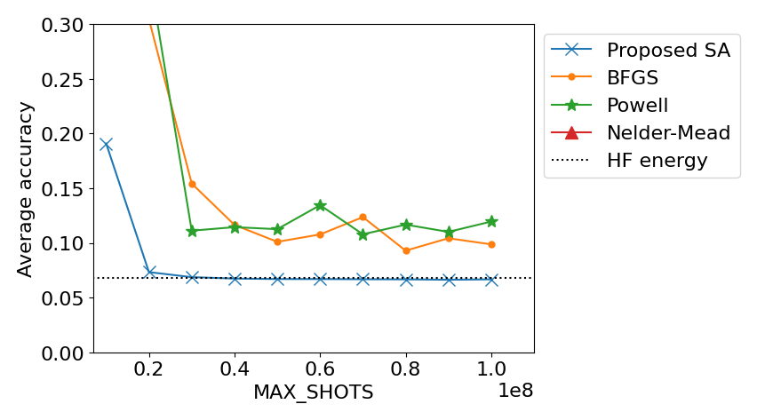

# QPARC-Challenge

## My Work
We measured the execution result of evalution.py by embarrassingly parallel using GNU Parallel. Measured data is existed /data/. We do not use Docker because of write-write conflict in free Docker.

The figure below shows the measurement results.
Detail description is https://docs.google.com/presentation/d/16L190ojXdD1MJO63VLkM46Ynn3d2DqpZZziPk3HulI0/edit#slide=id.g130e03013af_9_79



## How-to-run

### with poetry
Install poetry using `pip install poetry`.
Then
```
poetry install
poetry run python evaluation.py
```

### without poetry

```
pip install .
python evaluation.py
```

`evaluation.py` runs experiment 10 times and records final result.
`single.py` runs experiment single times for testing purpose.
